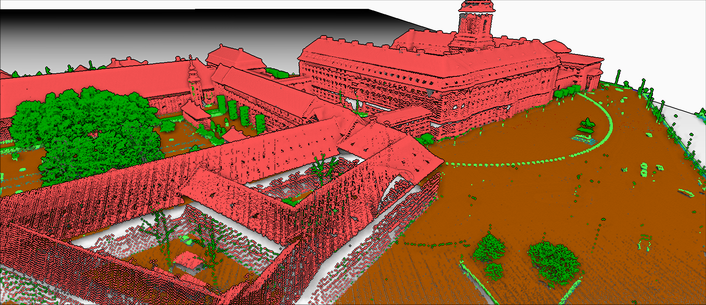
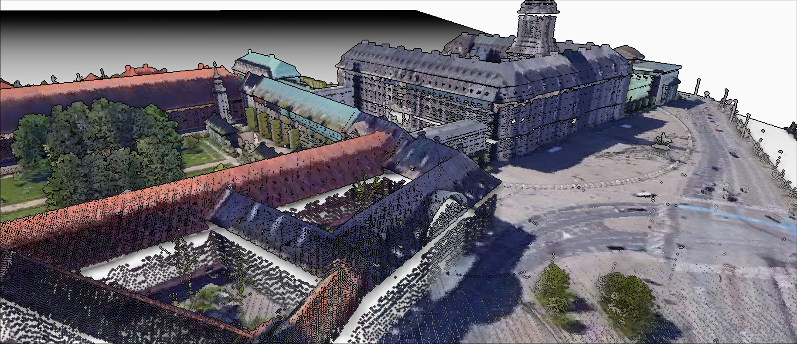

# QGIS 

## Establishing RGB data for LiDAR point cloud by extracting RGB information from optical satellite imagery

The data provided by the Danish authorities at https://dataforsyningen.dk/data/3931, contains LiDAR point cloud data for Denmark. The data is already clasiffied for the following classes:
* Unclassified
* Ground
* Low Vegetation
* Medium Vegetation
* High Vegetation
* Building
* Low Point (Noise)
* Reserved
* Water
* Bridge Deck
* High Noise

However, these labels have been applied automatically and some of them are not great for the purpose of training a model. But I have chosen to filter them out in the python section later on. The purpose of this section and for using QGIS is to add relevant RGB color channels to the point cloud for use in the machine learning features. 

### Plugin installation for QGIS
--------------------------------------------------------------
First LAStools must be installed to QGIS, but it will not work properly unless you also install the LAStools standalone program on your system and point to the folder in the QGIS plugin configuration tab

### Steps
--------------------------------------------------------------
1) Load the LAZ (or las) file into QGIS.
2) Load in high quality optical satellite imagery that is shot from the same angle. 
3) Export this satellite image as a geotiff, with a DPI of 600 and a area layer extent to that of the LiDAR data
4) Whilst having selected the LiDAR laz data layer, use the LAStools plugin from the processing toolbox and select file - processing points, followed by lascolor. Add the input laz file, add the geotiff file in the second bracking and select an output file location, add a name and click run.

### Finished product
The image does a decent enough job, however it is ideal that the RGB values are derived from the remote sensing LiDAR source in form of a simultaneously snapped optical image. As this screenshot shows, the wrapping of the image to the point cloud is not ideal

